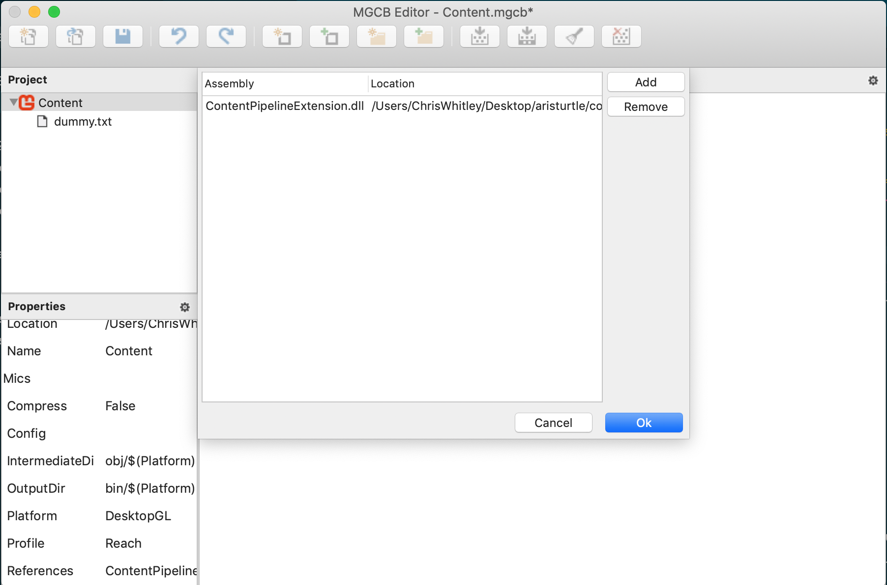
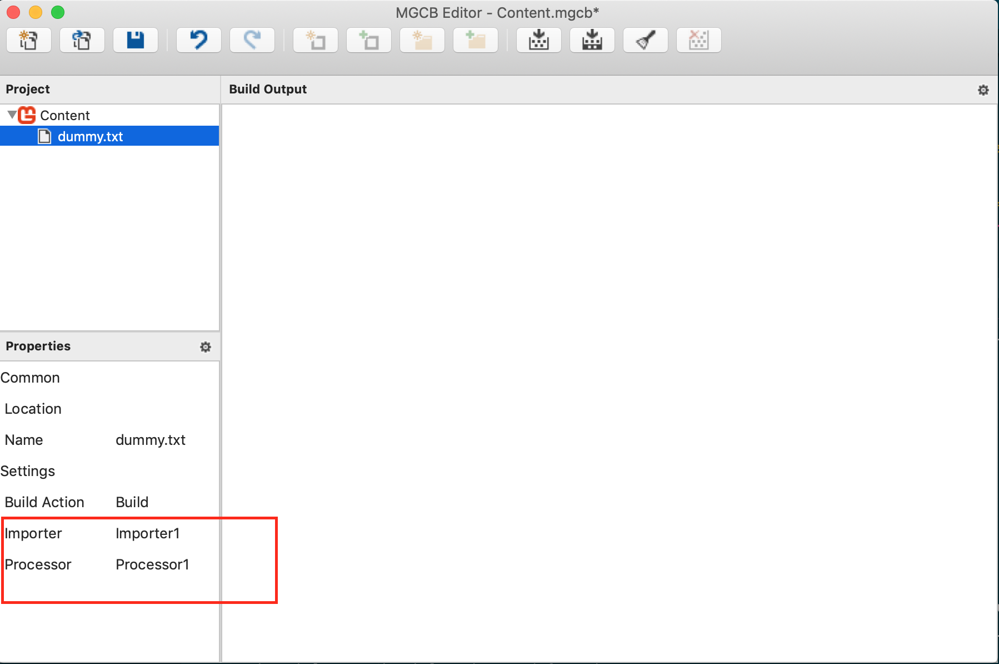
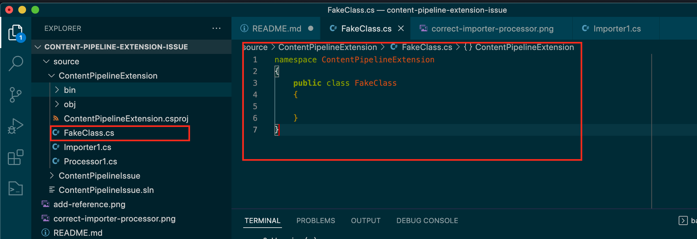
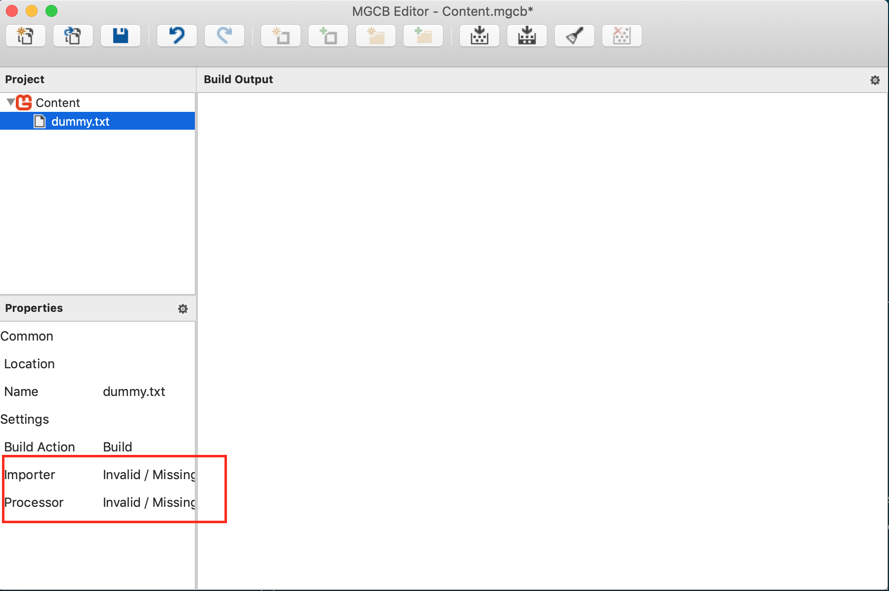

# Content Pipeline Extension Issue

## My Setup
* MacBook Pro (macOS Mojave version 10.14.6)
* Visual Studio Code
* MonoGame 3.8.0.1641

## The Problem
When creating a Content Pipeline extension, it seems that any class file added to the project that is not directly the Importer or Processor, the MGCB Editor is unable to load the Importer and/or Processor from the dll.  

This can be best describe by stepping through the steps to create the issue from scratch below.

## Recreating The Issue
1. Created a new solution file `dotnet new sln -n ContentPipelineIssue`

2. Created a new MonoGame Desktop GL project `dotnet new mgdesktopgl -n ContentPipelineIssue`

3. Create a new MonoGame Content Pipeline Extension project `dotnet new mgpipeline -n ContentPipelineExtension`

4. Added projects to the sln
    * `dotnet sln add ./ContentPipelineIssue/ContentPipelineIssue.csproj`
    * `dotnet sln add ./ContentPipelineExtension/ContentPipelineExtension.csproj`

5.  Add a dummy text file to **ContentPipelineIssue** directory `echo "" > ./ContentPipelineIssue/Content/dummy.txt`

6. Build projects `dotnet build`

7. Launch MGCB Editor `mgcb-editor`

8. Open the **ContentPipelineIssue/Content/Content.mgcb** file within the editor and add a reference to **ContentPipelineExtension/bin/Debug/netstandard2.0/ContentPipelineExtension.dll**



9. Choose to add an existing item and choose the **ContentPipelineIssue/Content/dummy.txt** file that was created.  When doing this, the correct Importer and Processor are choosen as **Importer1** and **Processor1**



10. Close the MGCB Editor, **do not save**.

11. Add a new class file to **ContentPipelineExtension** called **FakeClass.cs** and add the following code to the file

```cs
namespace ContentPipelineExtension
{
    public class FakeClass
    {
        
    }
}
```




12. Perform a clean and then a build. `dotnet clean && dotnet build`

13. Repeate steps 7, 8, and 9 to open the Content.mgcb file, add the dll reference, then add the dummy.txt file.  **Only this time, the Importer and Process are not found**



At this point, if you remove the **FakeClass.cs** and rebuild, the do the steps for the mgcb-editor, the Importer and Processor will show back up.  So it would appear that adding any class that is not directly the Importer and/or Processor to the extension project prevents it from loading properly in the mgcb-editor.  By Importer and Processor I mean class with the `[ContentImporter]` and `[ContentProcessor]` attributes and inheritences. 
